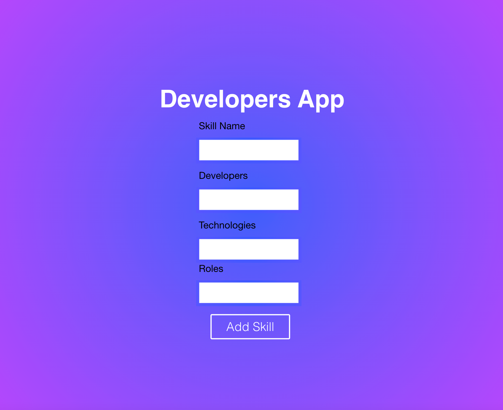

# Atividade Aulas 3 e 4: Page Objects e Cypress test

## Parte 1: Criar um formulário

Crie um formulário para adicionar uma nova skill como na imagem abaixo. Ao clicar no botão Add Skill, mostrar a lista de skills existentes. Não é necessário criar a lógica de enviar o formulário. Vamos usar um fake back end para isso. 



## Parte 2: Page Object e Cypress test

Crie um page object para esse formulário no arquivo de testes dentro do app react. Escreva um arquivo teste para esse componente usando o Cypress.

## Fake back end

Para o request do back-end, usar um fake backend online: https://mockapi.io/projects/61e4d942595afe00176e51cc dessa forma os resultados de implementação não ficarão no caminho para a escrita dos testes, que será a parte mais importante dessa tarefa.

Podem usar o app criado e dado como exemplo em aula, ou criar um para treinar a parte de setup do cypress.

Criar um react app:
```bash
$ npx create-react-app@5.0.0 ui-testing --template typescript 
```

Esse comando cria o app com typescript, criar as classes para os page objects dessa forma fica mais organizado, já que o typescript faz com que tenhamos atenção aos tipos e declações de variáveis.